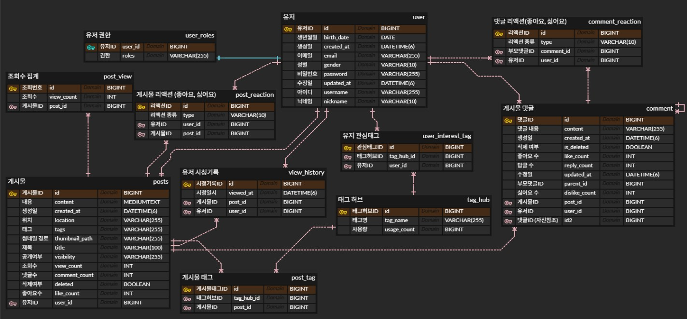
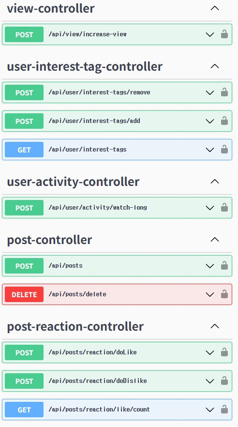
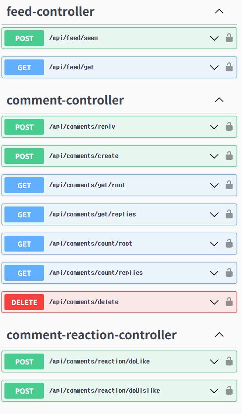
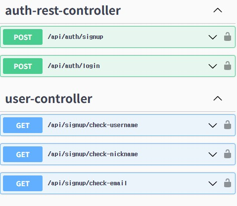
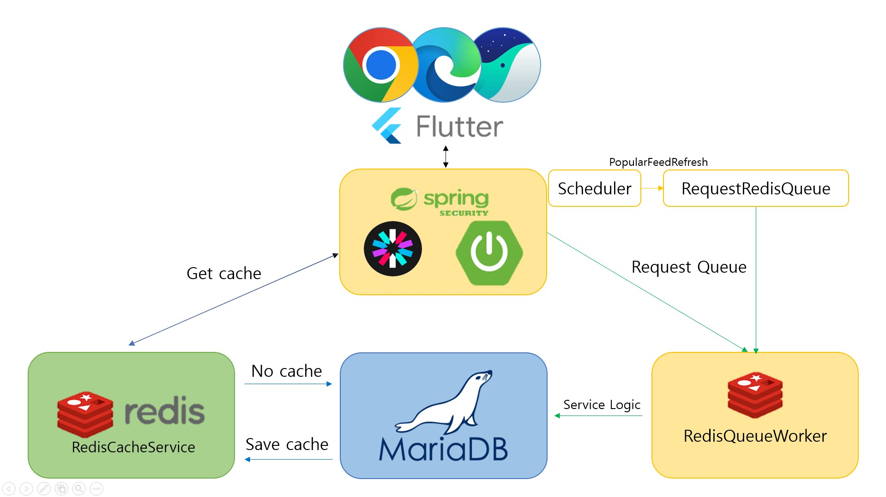
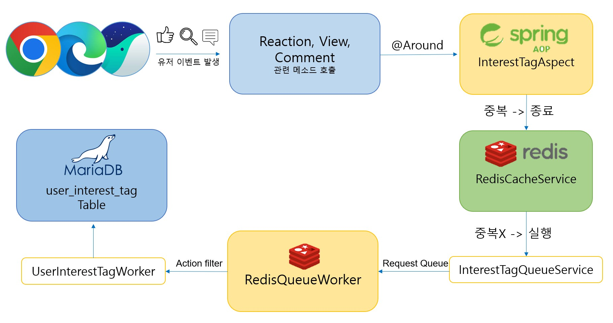

# texshorts  
#### 텍스트 컨텐츠 기반 SNS

# 기술 스택
* 빌드 툴
  * Gradle
      
* IDE
  * IntelliJ IDEA
      
* 형상관리
  * Git
      
* 백엔드
  * SpringBoot 3.5.0 
  * Spring Security + JWT
  * JPA
  * Redis
  * Redis Queue
  * MariaDB
  * Swagger
  * Git
      
* 아키텍처 / 방식
  * RESTful API 설계
  * DB 설계 (ERD)
  * 캐싱 전략 (Redis)
  * 메시지 큐 기반 비동기 로직 (Redis Queue)
  * 단위 / API 테스트 (Swagger)
  * AOP

  # DB, API 설계
  
  * ERD
    
          
  * Swagger API 목록

  
  
  

  

# 캐싱 전략, 레디스 큐 로직흐름

  

# 캐싱 (RedisCache) 활용 
* **대상 데이터** : 조회수, 좋아요/싫어요 수, 댓글 수
* **목적** : DB 과부하 감소 및 빠른 응답 제공
* **흐름** 
  * 클라이언트 요청 
  *  Spring Boot API 
  *  RedisCacheService에서 캐시 조회
  * 캐시 미스 시 DB에서 데이터 조회 후 캐시 저장 (TTL 설정하여 자동 만료)
  *  이후 요청은 캐시에서 빠르게 응답
 
# 큐 (RedisQueue) 활용
* **대상 작업** : 게시물 작성 후 무거운 후처리, 인기 게시물 피드 갱신
* **목적** : DB 과부하 감소 및 주기적 갱신 (인기 게시물)
* **흐름**
  * 게시물 작성/ 스케줄러 동작 시 RequestRedisQueue 요청
  * RedisQueueWorker 큐 메시지 비동기 수신
  * ServiceLogic에서 트랜잭션으로 DB 업데이트, 캐시 갱신
    
  * [30분 주기 갱신] Scheduler에서 인기 피드 갱신

# AOP > 큐활용

* **대상 작업** : 게시물 조회, 댓글 작성, 좋아요 반응
* **목적** : 관심태그 자동 갱신, 중복 이벤트 차단, 큐 기반 후처리, 관심사 분리
* **흐름**
  * 유저 이벤트 발생
  * 해당 서비스 메소드 실행 시 @Around에서 가로채기
  * RedisCacheService 조회 이벤트 > 중복검사
  * InterestTagQueueService Queue 요청
  * RedisQueueWorker 큐 메시지 비동기 수신
  * 이벤트 유형 필터링 (관심태그 추가/삭제 요청)후 실행
  * UserInterestWorker DB 유저 관심 태그 테이블 갱신